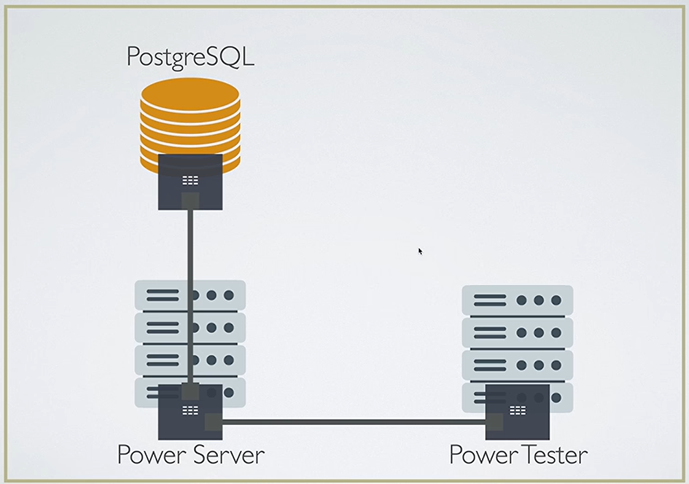

# Scaling to 1M Request in 1 Sec

```text
Core Utilization = ((Total Time - Total Idle Time) / Total Time) \* 100
```

**Core utilization** estimates how much of a measured interval one CPU core spent working instead of idle.

```text
CPU Utilization = (Core 1 + Core 2 +...+ Core N Utilizations) / Total number of cores
```

**CPU utilization** here is the average utilization across all cores.

Autocannon command:

```bash
autocannon -m GET -c 20 -d 20 -p 2 -w 1 "http://localhost:3001/simple"
```

- `autocannon`: Runs the HTTP load test.
- `GET`: Sends HTTP GET requests.
- `-c 20`: Uses 20 concurrent client connections.
- `-d 20`: Runs the test for 20 seconds.
- `-p 2`: Enables HTTP pipelining with up to 2 outstanding requests per connection.
- `-w 1`: Uses 1 worker thread to run the load test.
- `"http://localhost:3001/simple"`: The endpoint being tested on the local Express server.

## How to read the Autocannon output

- `Latency`: Time taken to receive a response; lower is better.
- `Req/Sec`: Number of requests processed per second; higher is better.
- `Bytes/Sec`: Data throughput in bytes per second; higher is better.
- `Avg`: Average value across all sampled measurements.
- `50%`: Median value in that row; half of the measurements are at or below this value.
- `97.5%` and `99%`: Percentile values; for latency, these help show slower-tail behavior. For throughput, they show the higher end of the sampled rates.
- `Max`: Highest recorded latency or throughput value, depending on the row.
- `# of samples`: Number of measurements. With multiple Autocannon workers, the total can exceed the test duration in seconds.
- `requests in Xs`: Total number of requests completed during the test duration.

---

## Benchmarks

### Simple route

The same simple endpoint was tested with three Node.js web frameworks:

- Port 3000: Cpeak
- Port 3001: Express
- Port 3002: Fastify

### 1) cpeak (PORT 3000)

```bash
$ autocannon -m GET -c 20 -d 20 -p 2 -w 1 "http://localhost:3000/simple"
```

```text
Running 20s test @ http://GET,http://localhost:3000/simple
20 connections with 2 pipelining factor
1 workers

| Stat    | 2.5% | 50% | 97.5% | 99% | Avg     | Stdev   | Max    |
|---------|------|-----|-------|-----|---------|---------|--------|
| Latency | 0 ms | 0 ms | 1 ms | 1 ms | 0.06 ms | 0.54 ms | 126 ms |

| Stat      | 1%     | 2.5%   | 50%    | 97.5%  | Avg       | Stdev   | Min     |
|-----------|--------|--------|--------|--------|-----------|---------|---------|
| Req/Sec   | 31,503 | 31,503 | 39,007 | 41,823 | 38,730.81 | 2,241.83 | 31,495  |
| Bytes/Sec | 5.39 MB | 5.39 MB | 6.67 MB | 7.15 MB | 6.62 MB | 384 kB | 5.39 MB |

Req/Bytes counts sampled once per second of samples: 20

781k requests in 20.84s, 132 MB read
3k errors (0 timeouts)
```

### 2) express (PORT 3001)

```bash
$ autocannon -m GET -c 20 -d 20 -p 2 -w 1 "http://localhost:3001/simple"
```

```text
Running 20s test @ http://GET,http://localhost:3001/simple
20 connections with 2 pipelining factor
1 workers

| Stat    | 2.5% | 50% | 97.5% | 99% | Avg    | Stdev | Max    |
|---------|------|-----|-------|-----|--------|-------|--------|
| Latency | 0 ms | 0 ms | 2 ms | 2 ms | 0.53 ms | 0.83 ms | 114 ms |

| Stat      | 1%     | 2.5%   | 50%    | 97.5%  | Avg       | Stdev  | Min     |
|-----------|--------|--------|--------|--------|-----------|--------|---------|
| Req/Sec   | 16,447 | 16,447 | 18,943 | 20,287 | 18,958.41 | 793.63 | 16,440  |
| Bytes/Sec | 4.13 MB | 4.13 MB | 4.76 MB | 5.09 MB | 4.76 MB | 199 kB | 4.13 MB |

Req/Bytes counts sampled once per second of samples: 20

385k requests in 20.83s, 95.2 MB read
3k errors (0 timeouts)
```

### 3) fastify (PORT 3002)

```bash
$ autocannon -m GET -c 20 -d 20 -p 2 -w 1 "http://localhost:3002/simple"
```

```text
Running 20s test @ http://GET,http://localhost:3002/simple
20 connections with 2 pipelining factor
1 workers

| Stat    | 2.5% | 50% | 97.5% | 99% | Avg    | Stdev   | Max    |
|---------|------|-----|-------|-----|--------|---------|--------|
| Latency | 0 ms | 0 ms | 1 ms | 1 ms | 0.07 ms | 0.51 ms | 109 ms |

| Stat      | 1%     | 2.5%   | 50%    | 97.5%  | Avg       | Stdev   | Min     |
|-----------|--------|--------|--------|--------|-----------|---------|---------|
| Req/Sec   | 29,647 | 29,647 | 35,711 | 38,463 | 35,302.4 | 2,722.85 | 29,644  |
| Bytes/Sec | 5.55 MB | 5.55 MB | 6.68 MB | 7.19 MB | 6.6 MB | 509 kB | 5.54 MB |

Req/Bytes counts sampled once per second of samples: 20

712k requests in 20.85s, 132 MB read
3k errors (0 timeouts)
```

### Conclusion

Based on these results, Cpeak had the highest throughput and lowest average latency for this workload. It handled roughly 781k requests in 20.84s, outperforming Express and Fastify under the same test conditions.

The saved GET output reports its URL as `http://GET,http://localhost:...`, which may indicate the old command treated `GET` as a URL instead of a method. The commands above use `-m GET`; rerun the simple-route tests before relying on the saved comparison.
---

## Patch Request Test

### Command

```bash
autocannon -m PATCH \
  -c 5 \
  -d 20 \
  -p 2 \
  -w 1 \
  -H "Content-Type: application/json" \
  --body '{
    "foo1": "alpha",
    "foo2": "beta",
    "foo3": "gamma",
    "foo4": "delta",
    "foo5": "epsilon",
    "foo6": "zeta",
    "foo7": "eta",
    "foo8": "theta",
    "foo9": "iota",
    "foo10": "kappa"
  }' \
  "http://localhost:3000/update-something/123/john?value1=one&value2=two"
```

### Result

```text
Running 20s test @ http://localhost:3000/update-something/123/john?value1=one&value2=two
5 connections with 2 pipelining factor
1 workers

| Stat    | 2.5% | 50% | 97.5% | 99% | Avg     | Stdev   | Max   |
|---------|------|-----|-------|-----|---------|---------|-------|
| Latency | 1 ms | 1 ms | 3 ms | 4 ms | 1.53 ms | 0.76 ms | 25 ms |

| Stat      | 1%     | 2.5%   | 50%    | 97.5%  | Avg     | Stdev   | Min     |
|-----------|--------|--------|--------|--------|---------|---------|---------|
| Req/Sec   | 3,929  | 3,929  | 5,035  | 5,219  | 4,777.3 | 428.99  | 3,928   |
| Bytes/Sec | 130 MB | 130 MB | 166 MB | 172 MB | 158 MB | 14.2 MB | 130 MB |

Req/Bytes counts sampled once per second of samples: 20

96k requests in 21.01s, 3.15 GB read
```

### With PM2

PM2 is a process manager for Node.js. Its cluster mode runs multiple server processes and shares incoming traffic among them. The PM2 config in `node-1m-rps-main/ecosystem.config.cjs` ran multiple Cpeak instances during this benchmark.

```bash
autocannon -m PATCH \
  -c 5 \
  -d 20 \
  -p 2 \
  -w 1 \
  -H "Content-Type: application/json" \
  --body '{
    "foo1": "alpha",
    "foo2": "beta",
    "foo3": "gamma",
    "foo4": "delta",
    "foo5": "epsilon",
    "foo6": "zeta",
    "foo7": "eta",
    "foo8": "theta",
    "foo9": "iota",
    "foo10": "kappa"
  }' \
  "http://localhost:3000/update-something/123/john?value1=one&value2=two"
```

```text
Running 20s test @ http://localhost:3000/update-something/123/john?value1=one&value2=two
5 connections with 2 pipelining factor
1 workers

| Stat    | 2.5% | 50% | 97.5% | 99% | Avg     | Stdev   | Max   |
|---------|------|-----|-------|-----|---------|---------|-------|
| Latency | 0 ms | 0 ms | 2 ms | 2 ms | 0.29 ms | 0.64 ms | 29 ms |

| Stat      | 1%     | 2.5%   | 50%    | 97.5%  | Avg      | Stdev    | Min    |
|-----------|--------|--------|--------|--------|----------|----------|--------|
| Req/Sec   | 7,783  | 7,783  | 12,143 | 17,471 | 12,251.2 | 2,721.44 | 7,782  |
| Bytes/Sec | 257 MB | 257 MB | 401 MB | 577 MB | 404 MB | 89.8 MB | 257 MB |

Req/Bytes counts sampled once per second of samples: 20

245k requests in 21.02s, 8.09 GB read
```

### With PM2 (second run)

```bash
autocannon -m PATCH \
  -c 5 \
  -d 20 \
  -p 2 \
  -w 1 \
  -H "Content-Type: application/json" \
  --body '{
    "foo1": "alpha",
    "foo2": "beta",
    "foo3": "gamma",
    "foo4": "delta",
    "foo5": "epsilon",
    "foo6": "zeta",
    "foo7": "eta",
    "foo8": "theta",
    "foo9": "iota",
    "foo10": "kappa"
  }' \
  "http://localhost:3000/update-something/123/john?value1=one&value2=two"
```

```text
Running 20s test @ http://localhost:3000/update-something/123/john?value1=one&value2=two
5 connections with 2 pipelining factor
1 workers

| Stat    | 2.5% | 50% | 97.5% | 99% | Avg     | Stdev   | Max   |
|---------|------|-----|-------|-----|---------|---------|-------|
| Latency | 0 ms | 0 ms | 1 ms | 1 ms | 0.13 ms | 0.39 ms | 26 ms |

| Stat      | 1%     | 2.5%   | 50%    | 97.5%  | Avg    | Stdev    | Min    |
|-----------|--------|--------|--------|--------|--------|----------|--------|
| Req/Sec   | 10,815 | 10,815 | 16,431 | 18,271 | 15,481 | 2,397.33 | 10,812 |
| Bytes/Sec | 357 MB | 357 MB | 542 MB | 603 MB | 511 MB | 79.2 MB | 357 MB |

Req/Bytes counts sampled once per second of samples: 20

310k requests in 20.01s, 10.2 GB read
```

---

## POST /code Request

```bash
autocannon -m POST \
  -c 5 \
  -d 20 \
  -p 2 \
  -w 1 \
 "http://localhost:3000/code"
```

### Result

`Running 20s test @ http://localhost:3000/code`

- 5 connections with 2 pipelining factor
- 1 workers

**Latency**

| Stat | 2.5% | 50% | 97.5% | 99% | Avg | Stdev | Max |
|---|---:|---:|---:|---:|---:|---:|---:|
| Latency | 1 ms | 2 ms | 5 ms | 6 ms | 2.56 ms | 1.34 ms | 48 ms |

**Throughput**

| Stat | 1% | 2.5% | 50% | 97.5% | Avg | Stdev | Min |
|---|---:|---:|---:|---:|---:|---:|---:|
| Req/Sec | 2,551 | 2,551 | 3,257 | 3,961 | 3,275.4 | 430.33 | 2,550 |
| Bytes/Sec | 1.89 MB | 1.89 MB | 2.41 MB | 2.93 MB | 2.42 MB | 319 kB | 1.89 MB |

Req/Bytes counts sampled once per second of samples: 20

66k requests in 20.01s, 48.5 MB read

### Cpeak PM2 Route Benchmarks

The Cpeak app was run with 12 PM2 cluster instances. Each Autocannon run used 20 connections, pipelining of 2, 6 load-generator workers, and a 20-second duration.

| Route | Avg latency | 99% latency | Avg req/sec | Requests | HTTP results |
|---|---:|---:|---:|---:|---|
| `GET /simple` | 0.31 ms | 4 ms | 52,195.6 | 1,044k | 200 |
| `PATCH /update-something/123/john_doe` | 2.94 ms | 14 ms | 10,428.9 | 209k | 200 |
| `POST /code` | 6.76 ms | 13 ms | 4,953.25 | 99k | 201 |
| `GET /code-v1` | 1,523.99 ms | 2,063 ms | 22.9 | 494 | 200 |
| `GET /code-v2` | 481.88 ms | 872 ms | 74.16 | 2k | 200 |
| `GET /code-v3` | 5.31 ms | 16 ms | 6,185.2 | 124k | 200 |
| `GET /code-v4` | 2.91 ms | 13 ms | 10,524.2 | 211k | 12,720 returned 200; 197,752 returned 404 |
| `POST /code-fast` | 5.25 ms | 21 ms | 6,250.35 | 125k | 201 |
| `GET /code-fast` | 1.39 ms | 5 ms | 18,961.8 | 379k | 200 |
| `POST /code-ultra-fast` | 2.47 ms | 7 ms | 12,084 | 242k | 201 |

A follow-up request checked the listed HTTP statuses. `/code-v4` chooses an ID from 1 to 10,000,000; with the current database size, most chosen IDs have no matching row, so its benchmark produced many expected 404 responses. The PATCH benchmark used `foo1` through `foo10` in the JSON request body.

---

## EC2 Test Notes

**Amazon EC2** provides virtual servers (instances) in AWS.

System: c8i.32xlarge

- 128 CPU Cores
- 256 C+GB RAM
- 50 Gbps (6.25 GB/s)
- $6/h ($5K/month) - approx cost as per 26 Sept, 2026

Take another machine to use autocannon to generate traffic

AWS Structure:


128 pm2 instances of the project on Power Server

```bash
$ autocannon -m GET -c 1000 -d 20 -p 100 -w 120 "${ec2Link}:3002/simple"
```

Run the same config for PATCH Request like above

---

## Additional Knowledge

- **Drogon:** A C++ framework for building web applications and APIs.
- **RapidJSON:** A C++ library for parsing and generating JSON.

---

## Redis Clustering

- **Redis Cluster** distributes keys across multiple Redis nodes using 16,384 hash slots. Each key belongs to one slot, and each primary node owns a range of slots.
- Redis calculates a key's slot from its hash. In simple terms, the hash decides which primary node handles that key.
- Replicas copy data from primary nodes and can be promoted if a primary fails.
- This project configures 30 nodes with one replica per primary: 15 primaries and 15 replicas. The client connects through port `7000` and discovers the other nodes.
- Keys with the same hash tag (the text inside `{}`) map to the same slot. For example, `user:{42}:profile` and `user:{42}:settings` share a slot. This matters when a Redis operation uses multiple keys.

To start the local cluster and run Cpeak in cluster mode:

```bash
./redis.sh -setup
REDIS_CLUSTER=true node cpeak.js
```
